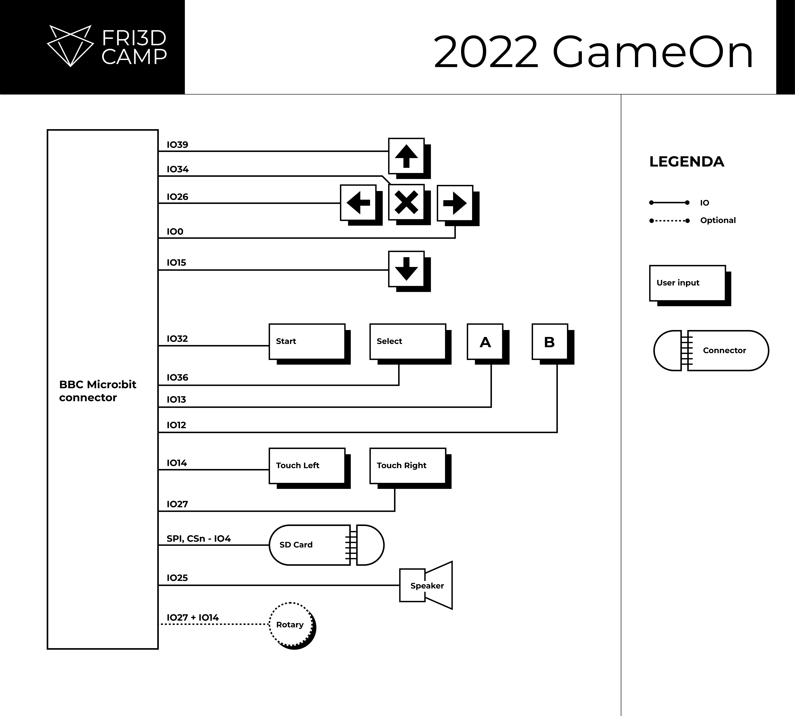
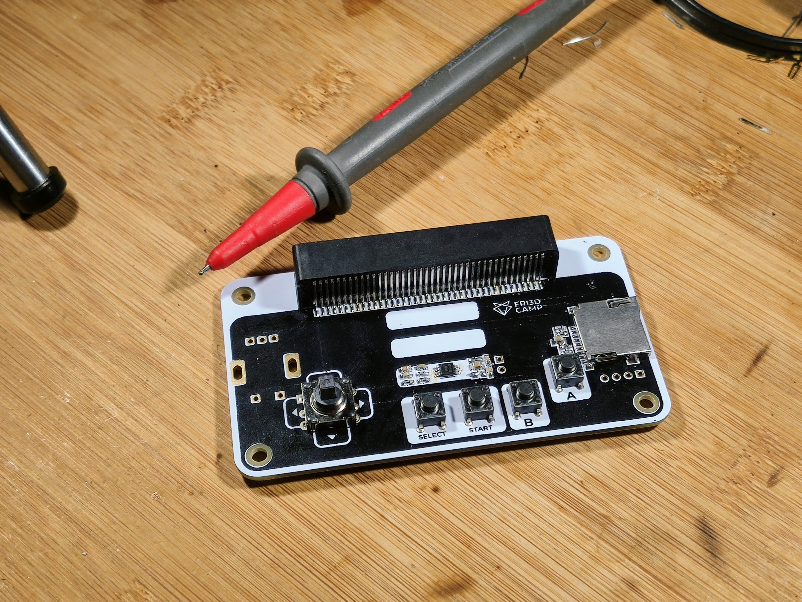
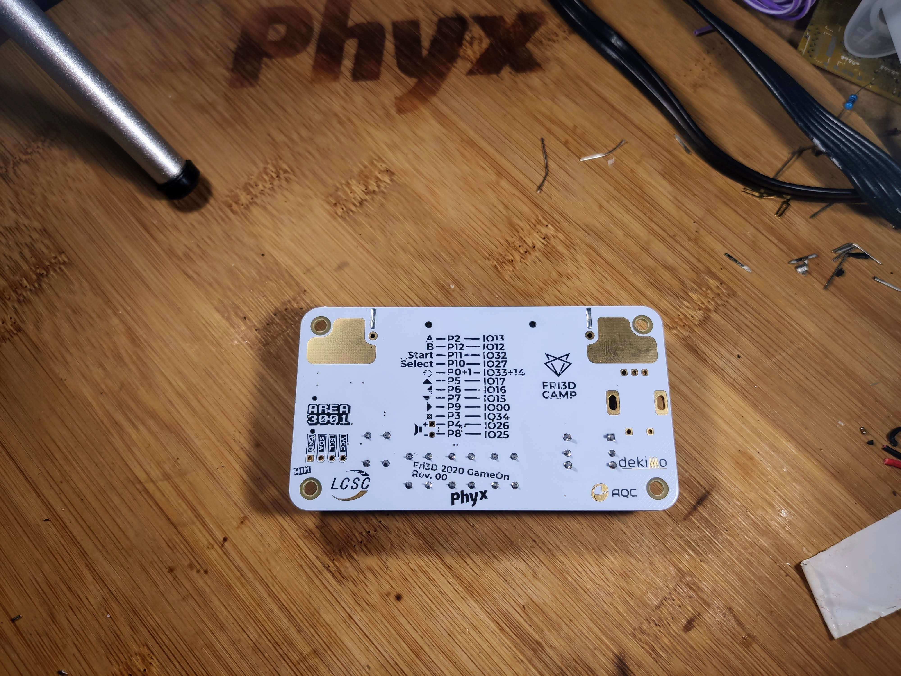
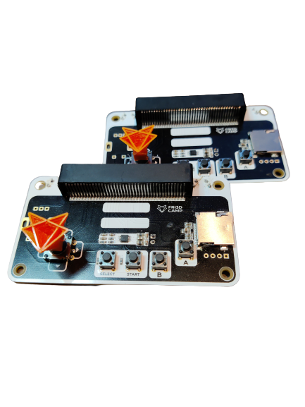

# Fri3d GameOn 2020

This repository contains the hardware design of the [Fri3d Camp](https://fri3d.be/) GameOn that connects to the [badge](https://github.com/Fri3dCamp/badge-2020).
The board consists our of a joystick, some buttons, a Micro SD card slot and a small 1W audio amplifier.
The project progress can be followed on our [Hackaday.io](https://hackaday.io/project/183766-gameon) page.

## Blockdiagram

In order to make the documentation easier to use, we've added the block diagram in this repository.

## REV 00
First prototype to verify the schematic design.

## REV 01
Modified the pinout for the new hardware revision of the badge.

## REV 02
Production version of the GameOn. 

Note that the Start button, connected to the [badge](https://github.com/Fri3dCamp/badge-2020) IO pin 32, is active high whilst all other buttons are active low.

## 3D Printed Joystick
[Mathy Vanvoorden](https://github.com/MathyV)) designed a small joystick to click on the directional switch. Thereby making the directional switch easier to use. You can find the 3D model in the mechanical folder.

